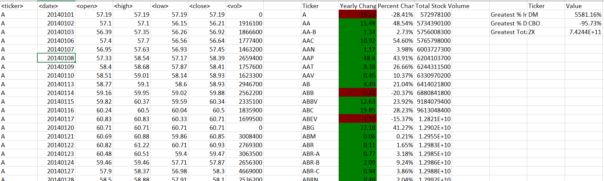
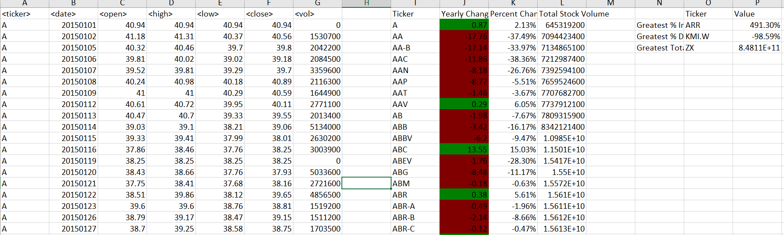

# The VBA of Wall Street

## Analysis
In this challenge a script was created to loop through all the stocks for one year to create a summary with the following information:
*	The ticker symbol.
*	Yearly change from opening price at the beginning of a given year to the closing price at the end of that year.
*	The percent change from opening price at the beginning of a given year to the closing price at the end of that year.
*	The total stock volume of the stock.
*	The greatest percent increase
*	The greatest percent decrease
*	The greatest total volume

## Stock Data 2014

## Stock Data 2015

